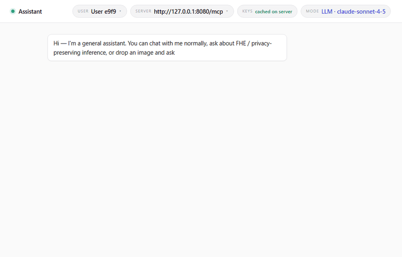

# Homomorphic-CatPrivacy

Privacy-preserving image classification under **Fully Homomorphic Encryption
(FHE)**. A CNN decides *cat / not-cat* on a 32×32 image while the inference
server computes **only on ciphertext** — it never sees your image, the
plaintext result, or any secret key.

> Created for the Hackathon associated with the IETF (ciphertext-based AI inference).

This repository ships two standalone Windows tools. Download them, run them,
done. No Python, no build step, no source required.



*Real run, sped up: encrypt locally → upload ciphertext → encrypted CNN
inference on the server → decrypt locally → "That's a cat. 79.9%".*

Dual-domain architecture (Figure 1 of the IETF draft). The two tools map onto
it directly: **`fhe-crypto-tool`** is the trusted Local Domain (MCP Client +
Local Crypto MCP Server), **`fhe-infer-tool`** is the untrusted Remote Domain
(Remote Inference MCP Server).

```
      (0) Key provisioning (init) -> obtain 'Key Reference'
+-------------------------------------------------------------+
|                 Local Domain (Trusted Zone)                 |   == fhe-crypto-tool
|                                                             |
|  +------------+ (1) tools/call: fhe_encrypt +------------+  |
|  |            |============================>| Local      |  |
|  |            | (2) Response: ciphertext    | Crypto     |  |
|  |            |<============================| MCP Server |  |
|  | MCP Client |                             | [Secret &  |  |
|  | (Agent)    | (5) tools/call: fhe_decrypt | Eval Key]  |  |
|  |            |============================>|            |  |
|  |            | (6) Response: plaintext     |            |  |
|  +------------+<============================+------------+  |
|      ^      |                                               |
+------|------|-----------------------------------------------+
       |      |
       |      | (3) tools/call: remote_inference {client_id, session_id, auth_token}
       |      |     (preceded by N x upload_ciphertext_chunk, by session_id)
+------|------|-----------------------------------------------+
|      |      |          Remote Domain (Untrusted)            |   == fhe-infer-tool
|  +---|------V--------------------------------------------+  |
|  |  (4) Response:         Remote Inference MCP Server    |  |
|  |      encrypted     [Homomorphic Model, Eval Key Cache]|  |
|  |      result                                           |  |
|  +-------------------------------------------------------+  |
+-------------------------------------------------------------+
```

## Download

Grab the two zips from the [**Releases**](../../releases) page:

| Tool | What it does | Run on |
|------|--------------|--------|
| `fhe-crypto-tool-win64.zip` | key generation, encryption, decryption — everything sensitive, all local | your machine |
| `fhe-infer-tool-win64.zip`  | ciphertext CNN inference | your machine (localhost) **or** a real server |

Unzip each into its own folder.

## Quick start — one machine

**1. Start the inference server** (terminal 1):

```powershell
cd fhe-infer-tool
.\fhe-infer-tool.exe --transport streamable-http --host 127.0.0.1 --port 8080
```

**2. Classify an image** (terminal 2):

```powershell
cd fhe-crypto-tool
.\fhe-crypto-tool.exe classify --image C:\path\to\photo.jpg --url http://127.0.0.1:8080/mcp
```

The **first** run generates your CKKS key set and registers ~1.8 GB of public
evaluation keys with the server (one-time, a few minutes). After that each
image takes about 1–2 minutes.

Output:

```
cat   probability 0.80   (70 s)
```

## Web UI (chat front-end)

The same pipeline with a browser chat interface — this is what the demo GIF
above shows:

```powershell
cd fhe-crypto-tool
.\fhe-crypto-tool.exe webui --url http://127.0.0.1:8080/mcp
```

Open `http://127.0.0.1:5000`, drop an image, ask *"is this a cat?"*.

Two chat modes (toggle in the header):

* **Templated** — default, fully offline, no API key needed.
* **LLM** — bring your own key for the conversational layer. Set one of
  `ANTHROPIC_API_KEY`, `OPENAI_API_KEY`, `DEEPSEEK_API_KEY`, or point
  `FHE_LLM_BASE_URL` / `FHE_LLM_API_KEY` / `FHE_LLM_MODEL` at any
  OpenAI-compatible endpoint.

Either way, the FHE pipeline is identical — the LLM only powers the chat
wording and never sees your keys or the server's ciphertext.

## Deploy the inference server on a real machine

Run the same server binary on a Linux/Windows host and expose port 8080 behind
a TLS reverse proxy:

```
./fhe-infer-tool --transport streamable-http --host 0.0.0.0 --port 8080
```

Point the client at it:

```powershell
.\fhe-crypto-tool.exe classify --image photo.jpg --url https://your-server.example/mcp
```

The server still only ever receives ciphertext and public evaluation keys.

## Privacy properties

* The **secret key** is generated and stays inside `fhe-crypto-tool`'s folder
  (`runtime_mcp\`). It is never transmitted.
* Only **ciphertext** and **public evaluation keys** are sent to the inference
  server.
* The inference server produces an **encrypted** result; only your local tool
  can decrypt it.
* This mirrors the protocol described in the companion IETF draft on
  ciphertext-based AI inference.

## Notes

* Windows x64 build. Non-UTF-8 consoles are handled automatically.
* Keys and per-run data live in `runtime_mcp\` next to each executable; delete
  that folder to reset.
* The binaries bundle OpenFHE (BSD-2-Clause) and the MinGW/GCC runtime
  (GPL + Runtime Library Exception) — see `THIRD-PARTY-LICENSES.txt` inside
  each zip.

## Slides

Hackathon slide deck: **slides/slides-126-hackathon-cat-privacy.pptx**

## License

The distributed binaries are provided free of charge for evaluation and
research. See `LICENSE` and the bundled third-party notices.
